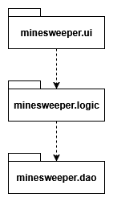

# Architecture

## Package structure

The project is divided into three main packages. The user interface code is in the minesweeper.ui package, the game logic and data models are in the minesweeper.logic package, and persistent storage is handled by data access objects in the minesweeper.dao package.



## User interface

The game consists of four different views:

- Main menu
- Game board
- Victory
- Game over

Each view is a JavaFX Scene that can be displayed on a Stage.

## Application logic

### Starting a game

When the user starts a new game by selecting a difficulty (beginner, intermediate or expert) from the main menu, the user interface calls the getBoardWindow() method to create the game view. The game logic is initialized by creating a new Board object with the correct size and number of mines based on the selected difficulty. The new game view is then displayed to the user by creating a new Scene with the board window. After the view is shown, the game timer starts to tick, and the user can begin interacting with the board by revealing tiles and placing flags. The game logic manages all tile actions and checks for win or loss conditions as the game progresses.


### Saving a game result

After winning a game, the user can save their completion time. The victory window includes a text field for the user's name and a save button. When the save button is pressed, the user interface calls the createGameResult() method from the GameResultService. This call passes the selected difficulty, the entered name and the time taken (in minutes and seconds). The service then creates a new GameResult object and saves it by calling the DAO's create() method. The new result appears in the personal bests list when the user returns to the main menu.


## Storing the information

The dao package handles saving and loading game results. All file operations are managed by the GameResultTextFileDAO class. Game results are stored as individual lines in a text file using a simple CSV format. Each line contains the difficulty, player name, minutes and seconds, separated by commas. For example:

```
BEGINNER,Player1,0,48
EXPERT,Player2,9,10
BEGINNER,Player1,0,47
INTERMEDIATE,Player1,2,50
```

When the application starts or the main menu is displayed, the DAO reads all existing results from the file. The service layer then sorts these results before providing them to the user interface for display. When a new result is saved, it is simply appended to the file.