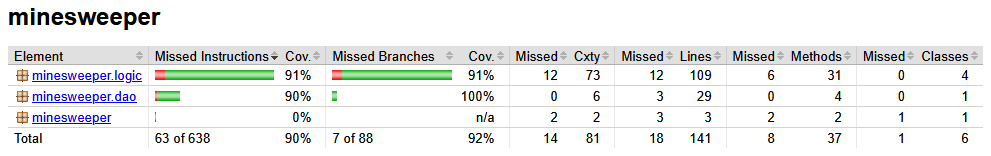

# Testing

The application was tested both manually and with JUnit tests during development.

## Unit and integration testing

### Application logic

The BoardTest class contains JUnit tests for the core logic in the minesweeper.logic package. Integration testing for the logic is handled by the GameResultServiceTest class.

### DAO classes

The DAO classes are tested using JUnit. The TemporaryFolder rule is used to make sure that file operations work correctly without affecting actual data.

### Test coverage

The test coverage was measured using JaCoCo. The coverage for the application is 90% for lines and 92% for branches. UI code is excluded from the coverage measurement.

