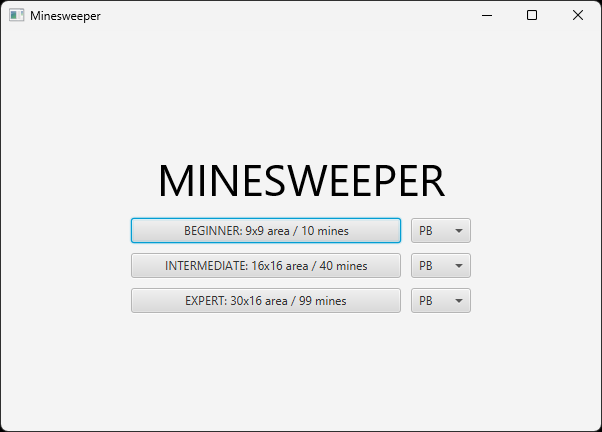
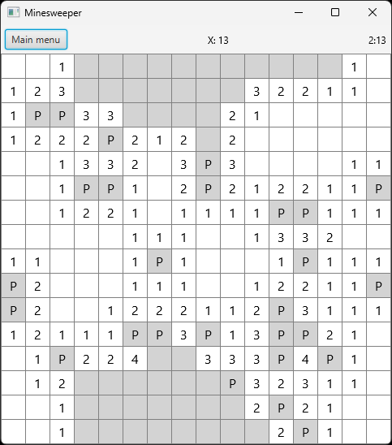
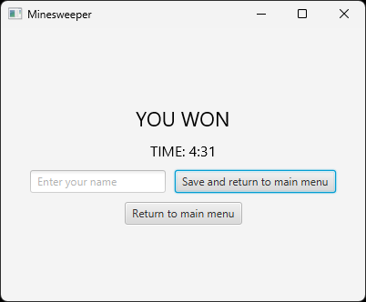

# User guide

## Getting started

To run the application, you'll need to have [Java](https://www.java.com/) installed on your computer. You can then download the latest .jar file from the [releases](https://github.com/jarkmaen/minesweeper/releases/tag/v1.0.0) page and run it directly.

Alternatively, if you want to run the application from the source code, refer to the [Command line operations](../README.md#command-line-operations) section of the README.

## Playing the game

The application starts at the main menu, where you can select a difficulty to begin a new game. Your personal bests (PBs) for each difficulty are also shown in the dropdown menus.

Once a game begins, left click a tile to reveal it. If you believe a tile is a mine, right click to place a flag on it.

When all safe tiles are revealed, you win the game and are taken to the victory screen. From here, you can enter your name and save your completion time to your personal bests or return to the main menu.

